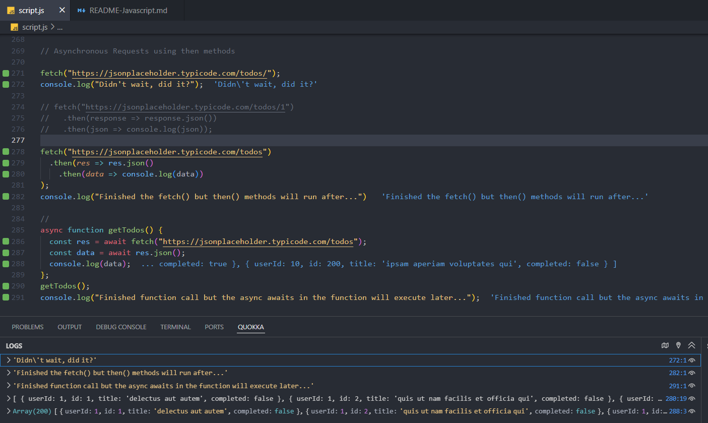

1. [The Udemy Ultimate React Course Javascript Review](#the-udemy-ultimate-react-course-javascript-review)
   1. [Quick Notes](#quick-notes)
   2. [Exercise 1 Notes](#exercise-1-notes)
   3. [What is React?](#what-is-react)
   4. [VS Code Setup](#vs-code-setup)
      1. [ESLint](#eslint)
      2. [Prettier Code Formatter](#prettier-code-formatter)
      3. [Quokka.js](#quokkajs)
      4. [For the course](#for-the-course)
      5. [Important Settings](#important-settings)
   5. [Options to Scaffold React App](#options-to-scaffold-react-app)
   6. [Running Create-React-App](#running-create-react-app)
   7. [Javascript Essentials](#javascript-essentials)
      1. [Destructuring](#destructuring)
      2. [Rest Operator](#rest-operator)
      3. [Spread Operator](#spread-operator)
      4. [Ternary Operators](#ternary-operators)
      5. [Arrow Functions](#arrow-functions)
      6. [Falsey, Truesy, and Short Circuiting](#falsey-truesy-and-short-circuiting)
      7. [Optional Chaining Operator](#optional-chaining-operator)
      8. [Array Map Method](#array-map-method)
      9. [Map Methods Chaining](#map-methods-chaining)
      10. [Array Reduce Method](#array-reduce-method)
      11. [Array Sort Method](#array-sort-method)
   8. [Updating and Adding to an Array](#updating-and-adding-to-an-array)
      1. [Updating an Array Entry](#updating-an-array-entry)
      2. [Adding New Array Entry](#adding-new-array-entry)
      3. [Deleting an Array Entry](#deleting-an-array-entry)
   9. [Asynchronous Javascript](#asynchronous-javascript)
      1. [Javascript using Promise Syntax](#javascript-using-promise-syntax)
      2. [Asynchronous Javascript Using Async/Await](#asynchronous-javascript-using-asyncawait)

# The Udemy Ultimate React Course Javascript Review

## Quick Notes

- Enter "react.new" in a browser window to create a new react project in CodeSandbox.
- The console messages in CodeSandbox can be found in the console tab inside of the “chrome dev tools” link

## Exercise 1 Notes

- The “App” function is a “react component”.
- The import must be at the very top of the .js file
- The “useEffect” function is executed before rendering the JSX
- The return block is “JSX” which is Javascript + HTML; compiled separately
- The return block can only have one parent HTML (e.g. “div”)

```javascript
import { useEffect, useState } from "react";

export default function App() {
  const [advice, setAdvice] = useState("");
  const [count, setCount] = useState(0);
  async function getAdvice() {
    const res = await fetch("https://api.adviceslip.com/advice");
    const data = await res.json();
    setAdvice(data.slip.advice);
    setCount((c) => c + 1);
  }

  useEffect(function () {
    getAdvice();
  }, []);

  return (
    <div>
      <h1>{advice}</h1>
      <button onClick={getAdvice}>Get Advice</button>
      <p>
        You have received <strong>{count}</strong> advice
      </p>
    </div>
  );
}
```

- Another component can be added to this application by defining a new react component named “Message”, as shown below.
- The component can be used in the JSX as though it was an HTML include but it relies on a state called “count” so it must be passed as a “Message” attribute.
- The “props” argument must be used to pass the count parameter to the Message component.

```javascript
import { useEffect, useState } from "react";

export default function App() {
  const [advice, setAdvice] = useState("");
  const [count, setCount] = useState(0);
  async function getAdvice() {
    const res = await fetch("https://api.adviceslip.com/advice");
    const data = await res.json();
    setAdvice(data.slip.advice);
    setCount((c) => c + 1);
  }

  useEffect(function () {
    getAdvice();
  }, []);

  return (
    <div>
      <h1>{advice}</h1>
      <button onClick={getAdvice}>Get Advice</button>
      <Message count={count} />
    </div>
  );

  function Message(props) {
    return (
      <p>
        You have received <strong>{props.count}</strong> advice
      </p>
    );
  }
}
```

## What is React?

React is a declarative, component-based, state-drive Javascript library for building user interfaces. Basically what React does is to render the components on the single-page app.

- Components are building blocks of user interfaces
- Components are defined used a declarative syntax called JSX
- JSX removes DOM details from the developer
- JSX is a syntax that combines HTML, CSS, JS and other components
- Main goal of React is to keep the UI in sync with the data on the page. That is where state comes into play.
- React is really just a **library** and not a framework because React only provides the view layer of the app.
- Next.js and Remix are actual **frameworks** built on top of React that provide additional capabilities.

## VS Code Setup

### ESLint

In addition to VS code, install _ESlint_, a code checker for JS.

- After download, run **npm install -g eslint**
- In VS code terminal, run **./node_modules\.bin\eslint –init**

### Prettier Code Formatter

Download and install the _Prettier Code Formatter_ extension and select it in the _Settings...Themes_ option.

### Quokka.js

Install the Quokka.js VS Code extension and run the `Start on Current File` Command. This extension is invaluable to get immediate feedback on the Javascript, as seen in the screenshot below. There is also a **Quokka Log** that contains structured output.



### For the course

- To make your VS Code environment look like the instructor's, install the folowing.
  - To make your code look like the instructor, download and install the “One Monakai Theme” and select it in the _Settings...Themes_ option.
  - Install the _Material Icon Theme_ and select it in the _Settings...Themes_ option

### Important Settings

- **Auto Save**: set to _on_ and _onFocusChange_

## Options to Scaffold React App

1. The **Create-React-App** command in react.dev will create a complete _starter kit_. The scaffolding includes ESLint, Prettier, Jest. Disadvantages is it includes slower components. Recommended not to use it for production implementations but it is _easy to use_.
2. **Vite** is quite different. It is a modern build tool. It does require a lot of setup so this course will use the first option. The package has hot module replacement and supports large scale apps through _bundling_ feature.

## Running Create-React-App

1. In the _project_ directory run: **npx create-react-app@5 pizza-menu**
   _Note_: The "@5" is a version appender need for the course
2. It will take a few minutes to run. When done you will see the following output.

```sh
Success! Created pizza-menu at C:\Users\ghughlett\Projects\pizza-menu
Inside that directory, you can run several commands:

  npm start
    Starts the development server.

  npm run build
    Bundles the app into static files for production.

  npm test
    Starts the test runner.

  npm run eject
    Removes this tool and copies build dependencies, configuration files
    and scripts into the app directory. If you do this, you can’t go back!

We suggest that you begin by typing:

  cd pizza-menu
  npm start
```

3. After running the above commands a dev server will be started and a browser page opended to port 3000.

   _Note:_ If you <CTL-C> you will kill the nmp start.

## Javascript Essentials

1. Destructuring, spread operator, template literals, ternaries
2. Promises
3. Async/await
4. Array processing using Map, filter, reduce, sort

### Destructuring

What is it? Destructuring is when you need some value that is stored in an array or object.

1. Added script.js from 02 starter folder
2. Installed **Quokka.js** extension so we could test JS right inside VS Code; ran quokka start on the current file to see the output of the Javascript in the _script.js_ sample file.
3. Rather than setting separate variables for each of the elements in the object, object destructuring could simply be done as shown in the example below where the book object has _title_ and _author_.

```javascript
const { title, author, genres } = book;
```

4. In an array, the values can be similarly destructured, as shown in the example below.

```javascript
const [primaryGenre, secondaryGenre] = book.genres;
```

**Note**: Each of the destructured variables are now standalone, e.g. _console.log(primaryGenre);_

### Rest Operator

Using the previous genres example, if you want to put the other array instances into its own array, then example below would show that.

```javascript
const [primaryGenre, secondaryGenre, ...otherGenres] = book;
otherGenres;
```

The display of _otherGenres_ would show genre entries after the secondaryGenre, as shown below.

```javascript
["speculative fiction", "short stories", "fantasy"];
```

### Spread Operator

1. A little confusing because it uses the same Rest **...** syntax. It is useful to add another entry to an existing array values.

```
const newGenres=[...book.genres,"epic fantasy"];
newGenres;
```

**Note**: The above would result in:

```javascript
[
  "science fiction",
  "humor",
  "speculative fiction",
  "short stories",
  "fantasy",
  "epic fantasy",
];
```

3. The spread operator is very useful when you want to add new properties to an object

```javascript
const updatedBook = { ...book, pages: 294, moviePublicationDate: "2001-12-19" };
updatedBook;
```

**Note**: Would result in overwriting of the _pages_ property and the addition of movePublicationDate being included in the object, as shown below.

```javascript
{
  id: 2,
  title: 'The Cyberiad',
  publicationDate: '1965-01-01',
  author: 'Stanislaw Lem',
genres: [...],
  hasMovieAdaptation: false,
  pages: 294,
  translations: {},
reviews: {...},
  moviePublicationDate: '2001-12-19'
}
```

**Note**: The above object update technique are important in React as they will allow objects to be updated that are to be rendered by React on the page.

### Ternary Operators

Example:

```javascript
const { title, author, pages, genres } = book;
const lengthSummary = pages > 1000 ? "long bookd" : "short book";
```

There are three parts to the ternary operator:

1. **condition**: expression
2. **true result**: e.g. _long book_
3. **false result**: e.g. _short book_

### Arrow Functions

Helpful technique introduced in ES6 to quickly write a function. It should be used to write one-liner functions but should continue to use a function declaration for a longer function.

```javascript
function getYear(dateString) {
  return dateString.split("-")[0];
}
console.log(`function declaration: ${getYear(publicationDate)}`);
```

**returns**: _function declaration: 1965_

OR

```javascript
const getYearExpression = (str) => str.split("-")[0];
console.log(`function expression: ${getYearExpression(publicationDate)}`);
```

**returns**: _function expression: 1965_ using a shorter, simpler form.

### Falsey, Truesy, and Short Circuiting

When writing if **AND (&&)** and **OR (||)** conditions it is important to understand when the expression is short-circuited. This introduces use of **falsey** and **truesy** operands.

**Falsey conditions**: 0, null, '', undefined

**Truesy**: 1, 'any string'

#### Examples using AND

The short-circuiting traverses the && conditions until a true value is found. If the first value is true then the remaining conditions are not considered.

`console.log(false && 'Some String')` returns **false**, as it was not necessary to evaluate

`console.log('a string is true' && 'Some String')` returns **Some String** because the first and 2nd conditions were true

#### Examples using OR

Here the short-circuiting behaves the exact opposite as the AND, where the conditions are considered if the preceding conditions are false.

`console.log(false || 'Some String')` return **Some String**

`console.log('a string is true' || 'Some String')` returns **a string is true**

`console.log(true || 'Some String')` returns **true**

The **?? operator** is referred to as the _Nullish Coalescing Operator_ which deals with cases, for example, when _zero_ is a legitimate conditional value and **not to be interpreted as false**.

Take the following example where the emptyArray length should be returned, rather than no data.

```javascript
const myArray = [];
console.log(myArray.length || "no data");
```

Above returns **no data** because zero is considered false.

```javascript
console.log(myArray.length ?? "no data");
```

Above returns **zero** because it is considered a truesy with the ?? operator.

### Optional Chaining Operator

There are cases where certain object properties may be undefined and then reference to them might fail. The optional chaining operator (?) helps out here. It tells JS to ignore the property if undefined.

In the example below a function is returning the sum of review counts, but the 2nd object is missing one.

```javascript
function sumReviews(object1, object2) {
  let obj1Count = object1.nbr1Reviews + object2.nbr2Reviews;
  let obj2Count = object1.nbr1Reviews + object2.nbr2Reviews;
  return obj1Count + obj2Count;
}
const obj1 = { id: "object1", nbr1Reviews: 15, nbr2Reviews: 5 };
const obj2 = { id: "object2", nbr1Reviews: 10 };
console.log(sumReviews(obj1, obj2));
```

An **NaN** (error) will be returned in the function when it tries to add the _nbr2Reviews_ count for object2. Instead optional chaining can be used, together with the _Nullish Coalescense Operator_ (specified as object1? and object2? in the summation expressions) which return 0, should the object the property not exist.

```javascript
const obj1 = { id: "object1", nbr1Reviews: 15, nbr2Reviews: 5 };
const obj2 = { id: "object2", nbr1Reviews: 10 };

function fixedSumReviews(object1, object2) {
  let obj1Count = (object1?.nbr1Reviews ?? 0) + (object1?.nbr2Reviews ?? 0);
  let obj2Count = (object2?.nbr1Reviews ?? 0) + (object2?.nbr2Reviews ?? 0);
  return obj1Count + obj2Count;
}
console.log(`fixedSumReviews: ${fixedSumReviews(obj1, obj2)}`);
```

The corrected version of the function returns the _template literal_ of **fixedSumReviews: 30**.

**Note**: The summation would not work properly until all expressions were wrapped in parantheses.

### Array Map Method

The map method duplicates the array and then provides a callback function to operate on the new array. Example below.

```javascript
const books = getBooks();
const shortBookDetails = books.map((book) => ({
  title: book.title,
  author: book.author,
  publicationYear: book.publicationDate.split("-")[0],
}));
console.log(shortBookDetails);
```

Returned array below. Since an array of object is being returned it was necessary to wrap the curly brances in parantheses.

```javascript
[
  {
    title: "The Lord of the Rings",
    author: "J. R. R. Tolkien",
    publicationYear: "1954",
  },
  { title: "The Cyberiad", author: "Stanislaw Lem", publicationYear: "1965" },
  { title: "Dune", author: "Frank Herbert", publicationYear: "1965" },
  {
    title: "Harry Potter and the Philosopher's Stone",
    author: "J. K. Rowling",
    publicationYear: "1997",
  },
  {
    title: "A Game of Thrones",
    author: "George R. R. Martin",
    publicationYear: "1996",
  },
];
```

### Map Methods Chaining

This example shows the filter method but it is being used somewhat inefficiently using filter and then map methods.

```javascript
const lengthyBooks = books.filter((book) => book.pages > 500);
lengthyBooks;
const shortBookDetails = lengthyBooks.map((book) => ({
  title: book.title,
  author: book.author,
  publicationYear: book.publicationDate.split("-")[0],
}));
console.log(shortBookDetails);
```

In the example below the filter and map methods are chained into one execution.

```javascript
const longBooksSummary = books
  .filter((book) => book.pages > 500)
  .map((book) => ({
    title: book.title,
    author: book.author,
    pages: book.pages,
    publicationYear: book.publicationDate.split("-")[0],
  }));
longBooksSummary;
```

The following was returned.

```javascript
[
  {
    title: "The Lord of the Rings",
    author: "J. R. R. Tolkien",
    pages: 1216,
    publicationYear: "1954",
  },
  {
    title: "Dune",
    author: "Frank Herbert",
    pages: 658,
    publicationYear: "1965",
  },
  {
    title: "A Game of Thrones",
    author: "George R. R. Martin",
    pages: 835,
    publicationYear: "1996",
  },
];
```

### Array Reduce Method

It is arguably the most powerful and versatile of the Array methods. The purpose of the method is to iterate over an array and **return an accumulated value**. The method takes a **callback function** and a **starting value** as its two arguments.

```
const pagesAllBooks = books.reduce((acc, book)=>acc + book.pages , 0);
pagesAllBooks;
```

### Array Sort Method

The sort method takes to two arguments representing the first and next values in the array. The callback function uses those two values, here **a - b** by convention, and the **a-b pattern** represents an ascending sort. If you want to sort in a descending sequence then specify **b - a** in the pattern.

If the a value is less than the b value, then a _negative is returned_ and the two values are ascending.

Below is a short version of the array sort.

```javascript
const arr = [3, 7, 1, 9, 6];
const sorted = arr.sort((a, b) => a - b);
sorted;
arr;
```

The above returns `[ 1, 3, 6, 7, 9 ]` in **sorted**. Notice also the arr variable also returns the same mutated value. See the WARNING below.

Below is a long version of the sort to show what really goes on.

```javascript
const sorted = arr.sort((a, b) => {
  if (a - b < 0) return -1;
  else if (a - b > 0) return +1;
  else return 0;
});
```

**WARNING**: The sort is a mutating function in that the arr variable will be changed by the sort. If you want to preserve the original value of arr, then you should make a copy of it.

```javascript
const sorted = arr.slice().sort((a, b) => a - b);
sorted;
arr;
```

The **slice method** makes a copy of _arr_ and the _sorted_ value is updated but the original arr value is preserved.

## Updating and Adding to an Array

The spread operator is used in both use cases.

### Updating an Array Entry

In this update example, book.id 1 **pages** property will be updated, and only this entry. The spread operator is used to pick up all other values of the book.

```javascript
const booksAfterUpdate = books.map((book) =>
  book.id === 1 ? { ...book, pages: 1225 } : book
);
booksAfterUpdate;
```

### Adding New Array Entry

In this example **book.id 6** will be added to the books array.

```javascript
const newBook = {
  id: 6,
  title: "Harry Potter and the Chamber of Secrets",
  author: "J. K. Rowling",
};

const booksAfterAdd = [...books, newBook];
booksAfterAdd;
```

### Deleting an Array Entry

The filter method can be used to preclude an entry from inclusion in the final array.

```
const booksAfterDelete = booksAfterAdd.filter((book) => book.id !== 6);
booksAfterDelete;
```

## Asynchronous Javascript

There are two main options for doing aysnc Javascript:

1. Using Promises (fetch and then method)
2. Async/Await

### Javascript using Promise Syntax

Example uses the Google jsonplaceholder API (https://jsonplaceholder.typicode.com/). This site comes with a variety of difference resources against which you can run API requests.

```sh
JSONPlaceholder comes with a set of 6 common resources:

/posts	100 posts
/comments	500 comments
/albums	100 albums
/photos	5000 photos
/todos	200 todos
/users	10 users
```

Simply referencing a resource, e.g. todos it will exhibit async behavior as illustrated below.

```javascript
fetch("https://jsonplaceholder.typicode.com/todos/");
console.log("Didn't wait, did it?");
```

The fetch runs without waiting and the console.log message appears immediately. This introduces the notion of a promise(d) response.

Here's the full fetch as in the Try It section of that site.

```javascript
fetch("https://jsonplaceholder.typicode.com/todos/1")
  .then((response) => response.json())
  .then((json) => console.log(json));
```

Here is the output of the fetch: `{ userId: 1, id: 1, title: 'delectus aut autem', completed: false }`

The fetch method has a number of Promise states.

- _pending_ - still working
- _redacted_ - error
- _fulfilled_ - API request completed

When the fulfilled state has completed the **.then()** method can be used to process the response.

The following example illustrates how async promises are often nested. In the example below, the json() method also is asynchronous and requires a Promise (i.e. then() method) to handle its response (**data**).

```javascript
fetch("https://jsonplaceholder.typicode.com/todos").then((res) =>
  res.json().then((data) => console.log(data))
);
console.log("Finished the fetch() but then() methods will run after...");
```

The **Finished... console log message** will be seen next and shortly after that, the nested **then methods** run and return an array of 200 objects.

```javascript
Finished the fetch() but then() methods will run after...
[ { userId: 1,
    id: 1,
    title: 'delectus aut autem',
    completed: false },
  { userId: 1,
    id: 2,
    title: 'quis ut nam facilis et officia qui',
    completed: false },
    ...
  { userId: 10,
    id: 200,
    title: 'ipsam aperiam voluptates qui',
    completed: false }]
```

### Asynchronous Javascript Using Async/Await

This technique provides a cleaner syntax than using the then method. In this technique the processing does not move after the fetch due to the **await** keyword.

```javascript
async function getTodos() {
  const res = await fetch("https://jsonplaceholder.typicode.com/todos");
  const data = await res.json();
  console.log(data);
}
getTodos();
console.log(
  "Finished function call but the async awaits in the function will execute later..."
);
```

The output of the **console.log(data)** in the above example returned the array of 200 entries as in the Promise technique, in a cleaner manner.

**IMPORTANT**: It still executed asynchronously. the Finished console log statement ran immediately after calling the function, and the function await processing ran later.
