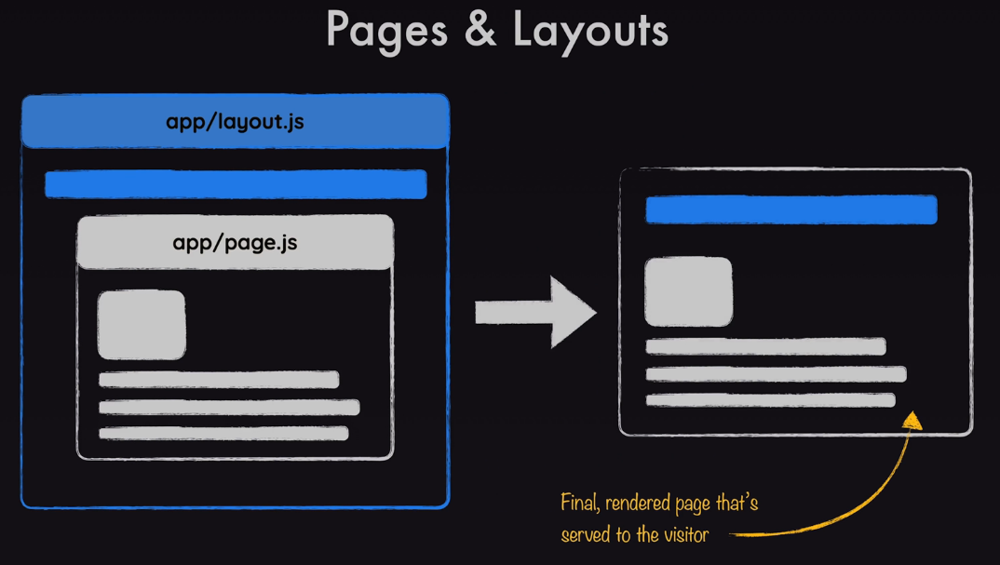

1. [Getting Started](#getting-started)
2. [NextJS Routing](#nextjs-routing)
3. [Link](#link)
4. [Pages \& Layouts](#pages--layouts)
   1. [The Root Layout](#the-root-layout)
5. [Client React Components](#client-react-components)

---

# Getting Started
Create the nextJS project using this command: `npx create-next-app@latest [project name]`

# NextJS Routing
Routing occurs by the definition of the app/page.js as well as other nested page.js files, and only with the page.js name. So, `app/oogabooga.js` would not affect routing.

# Link 
Don't use the html anchor tag to create links to other client pages as this will cause a page reload. Instead use the Link component, as shown below.

```javascript
import Link from 'next/link';

export default function Home() {
  return (
    <main>
      
      <h1>Welcome to this NextJS Course!</h1>
      <p>🔥 Let&apos;s get started! 🔥</p>
      <p><Link href="/about">About Us</Link></p>
    </main>
  );
}
```

**Note**:
- The above Home page is located in `app/page.js` and it references a page in `about/page.js`.

- When you click on the above link you'll see **the page does not reload**.

- When looking at the Inspect/Network tab you will see network activity but it is due to the server side rendering. The browser page is not impacted.

# Pages & Layouts
There must be root layout file (app/layout.js) defined but there can be nested layout files, for example defined in a page directory (e.g. about/layout.js). 



## The Root Layout
The `app/layout.js` file is a wrapper for the client application.

```javascript
import './globals.css'

export const metadata = {
  title: 'NextJS Course App',
  description: 'Your first NextJS app!',
};

export default function RootLayout({ children }) {
  return (
    <html lang="en">
      <body>{children}</body>
    </html>
  );
}
```

**Notes**: 

- Because the `globals.css` file is imported into the root layout, it is available to all components rendered in the app. Good way to share common CSS.

- What interesting about the root layout is that includes the `<html>` tag which essentially provides the application HTML.

- Application pages are rendered inside the props `chidren`, enclosed within the `html` tag.

- The exported `metadata` variable contains an object that will be inserted in the `<head>` element.

- An application icon was not imported into the layout because the `app/icon.png` provides this by default.

# Client React Components
In the example below, a app/components/header.js component was created to be referenced in the Home page. 

```javascript
export default function Header() {
    return (
        <>
            
            <h1>Welcome to this NextJS Course!</h1>
            <p>🔥 Let&apos;s get started! 🔥</p>
        </>
    );
}
```

**Notes**:

- `The export default function ...` syntax must prepend the React component function name or it won't compile on the server.

- By convention the file name should be lower case (e.g. `header.js`), like the other .js pages. 

- Placing React components in an `/components` directory is [one of many convention alternatives](https://nextjs.org/docs/app/getting-started/project-structure#colocation). Max likes to keep it in the app directory and not in a separate components folder.

- When importing a react component, you can use the `@` nextJS convention to refer to the root directory, as shown below.

    ```javascript
    import Header from '@/components/header';
    ```