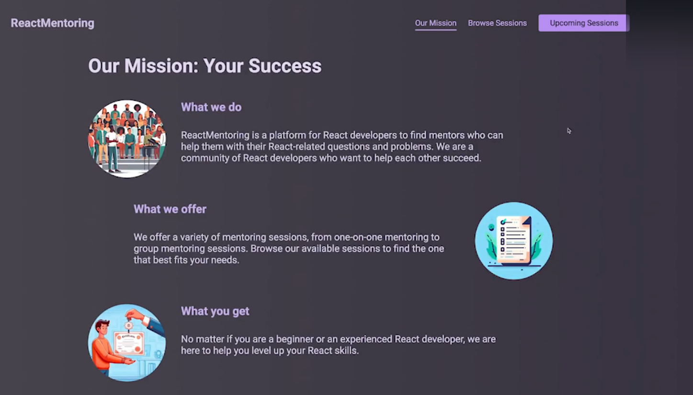
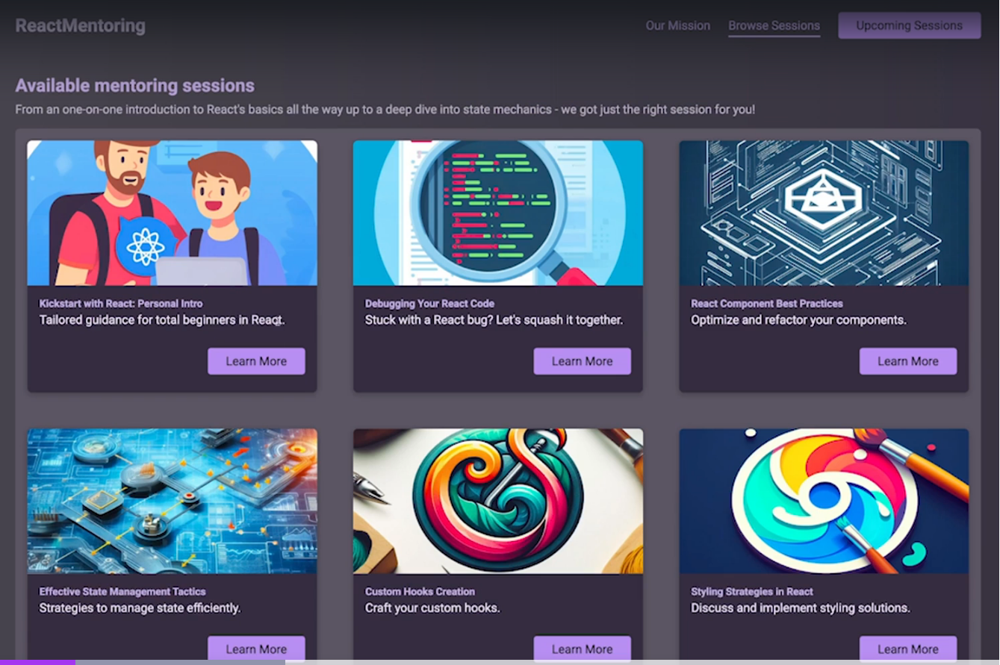
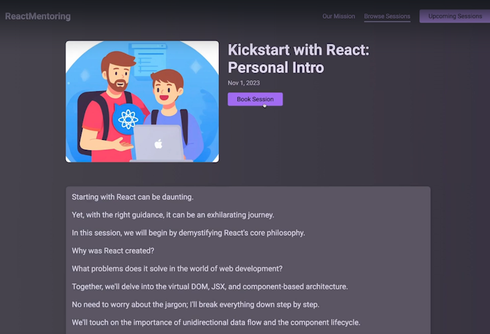
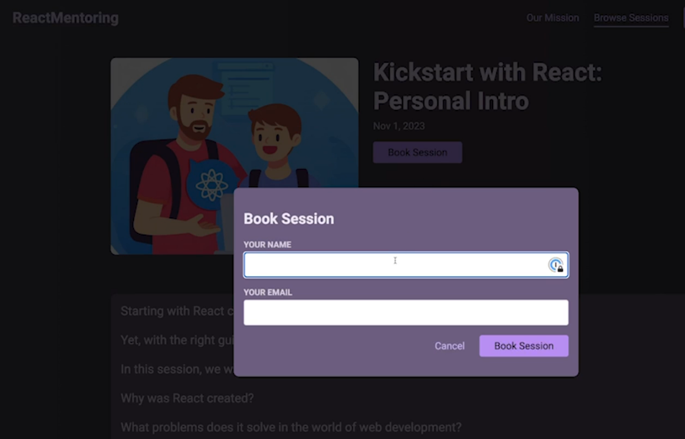
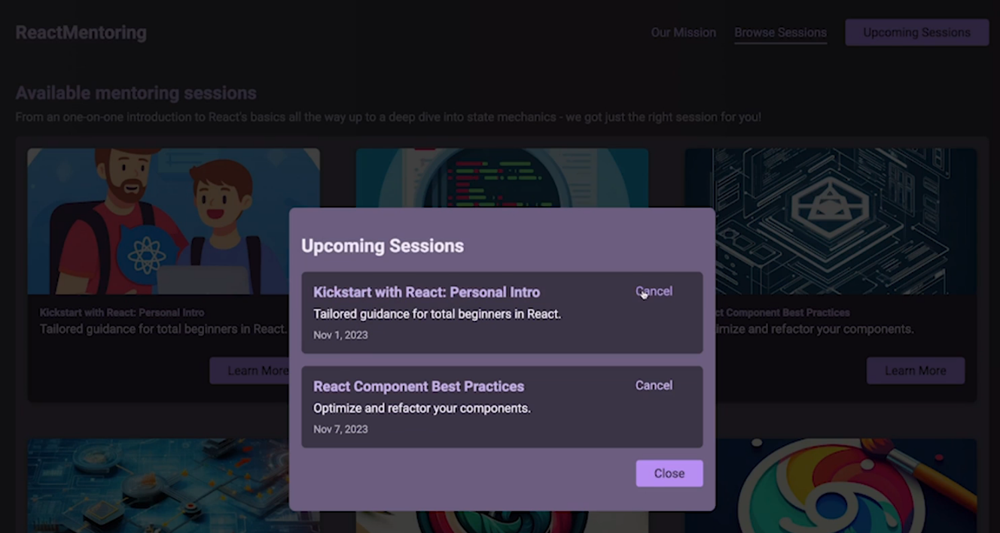
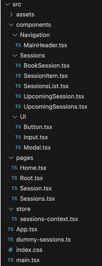

# typescript-zod-redux-book-session-exercise

React Typescript project with Redux and Zod

## GitHub Initialization Commands

Before running the commands, login to GitHub and create a private repo on GitHub. For the repo specify a `.gitignore` file using Node template. Create a README markdown file as well.

Copy the repo URL into the 2nd command below. Then run them in a terminal window in the new project.

```sh
git init
git remote add origin https://github.com/greg1951/typescript-zod-redux-book-session-exercise.git
git pull origin master
git add .
git commit -m "first commit"
git push -u origin master --force
git branch develop
git checkout develop
```

# Exercise Summary

- Install Zod and Redux libraries
- Reusable Button component that renders a button or a link. Both _button_ and _Link_ should receive a "button" CSS class
- Reusable Input wrapper component with _label_ and _input_ in a _div_, using a spread operator to accept attribute props
- custom modal component built on _dialog_ and used for the **Book a Session** and **Upcoming Sessions**
- Book sessions managed centrally via Redux (not Context API as exercise prescribes)
- Header component will have buttons to drive session functions
  

- Browse available sessions page
  

- Sign up for a session page
  

- Book session dialog
  
  
- Upcoming sessions, With Cancelation dialog
  

# Helpful Hints

- Get familiar with [React Browser Router](https://reactrouter.com/api/data-routers/RouterProvider) that is implemented in the App component. There are no changes needed to the App component however.
- Project Structure

  

- Review `index.css` file
- React Router & Typescript: `import { type LinkProps } from 'react-router-dom';`
- Custom modal component

  - For this project, you should build a custom Modal component that renders the built-in _dialog_ element and calls the openModal() method on that element whenever an exposed open() method is triggered from outside the Modal component.
  - To call the built-in openModal() method on _dialog_, you'll need to use a ref that's connected to _dialog_ (from inside the Modal component).
  - To expose a callable open() method that then calls openModal() on _dialog_, you'll need to use the useImperativeHandle() Hook inside the Modal component.

- Getting User Input

  - Use useState() and two-way-binding
  - Use Refs (via useRef())
  - Use the built-in FormData class
  - Use the built-in FormData class to let the browser help me. By using new FormData(form), you'll automatically get an object that gives you access to the data entered by the user.
  - You'll have to make sure that you did assign the name prop to every _input_ (or, in this app: _Input_, since you should build a custom wrapper Input component). Because only inputs with a name will be registered in the object created by FormData

# Component Hierarchy

The components are of various types located in the **src/components** directory. Some components are pages to be rendered, located in the **pages** subdirectory. All navigation occurs from the **navigation/Header** component and UI components are found in the **ui** subdirectory.


