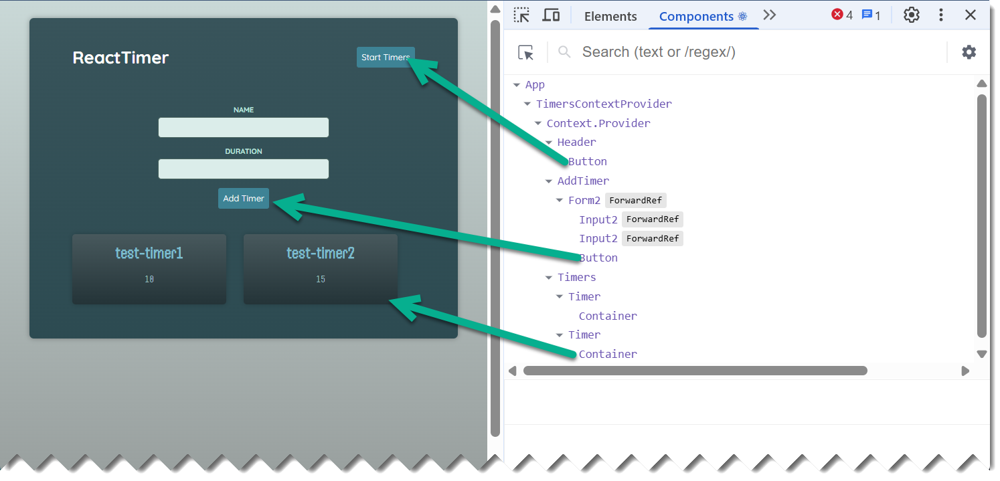
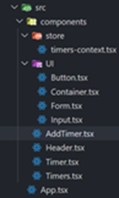

1. [Section Summary](#section-summary)
2. [_Cannot find package 'vite'_ Error](#cannot-find-package-vite-error)
3. [Conceptual Overview of Context API and useReducer Hook](#conceptual-overview-of-context-api-and-usereducer-hook)
   1. [Context API](#context-api)
   2. [The useReducer Hook](#the-usereducer-hook)
   3. [Key Differences](#key-differences)
   4. [How They Work Together:](#how-they-work-together)
4. [Context Setup](#context-setup)
   1. [Source Directories Setup](#source-directories-setup)
   2. [Context Object Setup](#context-object-setup)
   3. [Define Context Provider Function](#define-context-provider-function)
   4. [Create the Custom Hook](#create-the-custom-hook)
   5. [Use the Custom Hook](#use-the-custom-hook)
5. [Side Effects \& Data Fetching](#side-effects--data-fetching)
   1. [Start Timer](#start-timer)
   2. [Implement Effect](#implement-effect)
   3. [Implement UseRef](#implement-useref)

# Section Summary

This section will build on the Form component built in previous section but with some added components.

- Review of React's Context API
- Creating a custom hook to easily access state and methods to update it
- Creating a useReducer hook to manage complex state logic
- And how to use Typescript with these features



Note the App component is wrapped entirely by the `TimersContextProvider`. That context provides all of the Timers state needed by the components.

# _Cannot find package 'vite'_ Error

After copying the starter project into VS Code, got this error when _npm install_ ran. The solution was to simply run `npm install vite`

# Conceptual Overview of Context API and useReducer Hook

The example used in this topic will utilize both the React Context API and the useReducer hook. There's quite a lot of code in the context TSX file and a few moving parts so a high-level explanation is useful.

## Context API

The rationale for using the React Context API is that it **helps to manage state across the React application**, where there are multiple components that need to work together, _without the need for prop drilling_. (Alternatively, 3rd party tool like Redux could be used to do this.)

The idea is to wrap a part of your component tree with the Context provider, as shown in the App example below using the `TimersContextProvider` Context.

```javascript
import AddTimer from "./components/AddTimer.tsx";
import Header from "./components/Header.tsx";
import Timers from "./components/Timers.tsx";
import TimersContextProvider from "./components/store/timers-context.tsx";

export default function App() {
  return (
    <TimersContextProvider>
      <Header />
      <main>
        <AddTimer />
        <Timers />
      </main>
    </TimersContextProvider>
  );
}
```

## The useReducer Hook

- The useReducer is a React hook used for managing complex state logic within a single component or a part of your application. It is an alternative to useState when state transitions are more complicated and where there is a dependency on the previous state.

- It takes a reducer function (similar to Redux reducers) and an initial state, and returns the current state and a dispatch function. The dispatch function is used to send "actions" to the reducer, which then updates the state based on the action type.

- Used primarily for local or component-level state management, it can provide global state management when used with the React Context API.

## Key Differences

- The useReducer hook focuses on how state is updated, providing a structured and predictable way to manage complex state transitions.

- Context.Provider focuses on how state (or any data) is passed down the component tree, making it accessible to deeply nested components without explicit prop passing.

## How They Work Together:

Often, useReducer and Context are used together to manage global application state.

- You can use useReducer to manage the complex state logic at a higher level (e.g., in an application's main component or a dedicated state management component)
- Then use Context.Provider to expose that state and its associated dispatch function to the rest of the application, allowing any component to access the state and trigger updates.

When the context is defined then a custom hook is used to retrieve the context state and methods for use in the application. In the example below, the `Header` component, the `useTimersContext` is the hook that will do this. The **isRunning** boolean is used to set the Button state in the TSX.

```javascript
export default function Header() {
  const timersCtx = useTimersContext();
  return (
    <header>
      <h1>ReactTimer</h1>
      {timersCtx.isRunning ? (
        <Button>Stop Timers</Button>
      ) : (
        <Button>Start Timers</Button>
      )}
    </header>
  );
}
```

# Context Setup

A _src/components/store_ directory is generally used to keep (or "store") context of state using the Context API.

In the example below, a store/timers-context.tsx was created consisting of these two initial lines, to seed the Context object associated with the timers.

```javascript
import { createContext } from "react";
const TimersContext = createContext(null);
```

**Notes:**

- The constant variable name `TimersContext` is **upper case** as it will be used as the **component object** that manage the timers state.
- The `createContext` function needs an initial value, so _null_ was provided, but this initial value will be better defined later.

## Source Directories Setup

- The project source directory has a **src/components** directory where all component can be found.
- Some of the components that are UI-centric are separated into the **src/components/UI** directory.
- The Context definition itself (`timers-context.tsx`) is located in the **src/store** directory.



## Context Object Setup

The next step in establishing the context store component is to define the object types (`Timer`, `TimerState`) and the methods (`TimersContextValue`) that provide the _actions_ used to update the state.

```javascript
import { createContext } from "react";
type Timer = {
  name: string,
  duration: number,
};
type TimerState = {
  isRunning: boolean,
  timers: Timer[],
};
type TimersContextValue = TimersState & {
  addTimer: (timerData: Timer) => void,
  startTimer: () => void,
  stopTimer: () => void,
};
const TimersContext = (createContext < TimersContextValue) | (null > null);
```

**Notes:**

- This latter object is the used as a type for the `createContext function`.

- It is the `TimersContext` that will be used later to create a **custom hook** used by components to retrieve the state and methods associated with timers.

## Define Context Provider Function

It is quite common using the Context API to define a provider function that allows other components to then manipulate state stored in this context **using dispatchers**. This function is the default export of the Context.

(code below is a continuation of previous section)

```javascript
...
type TimerContextProviderProps = {
  children: ReactNode;
};

const initialState = {
  isRunning: false,
  timers: [],
};

export default function TimersContextProvider({
  children,
}: TimerContextProviderProps) {
  const [timerState, dispatch] = useReducer(timersReducer, initialState);
  const ctx: TimersContextValue = {
    timers: timerState.timers,
    isRunning: timerState.isRunning,
    addTimer(timerData) {
      dispatch({ type: "ADD_TIMER", payload: timerData });
    },
    startTimers() {
      dispatch({ type: "START_TIMERS" });
    },
    stopTimers() {
      dispatch({ type: "STOP_TIMERS" });
    },
  };
  return (
    <TimersContext.Provider value={ctx}>{children}</TimersContext.Provider>
  );
}
```

**Notes:**

- Why is this called a provider, what does that term mean? In React, the It is the provider that returns the context state and methods.

- The `ctx` constant is of type `TimersContextValue` which is a union of two types, `TimerState` and the `custom type` containing the add, start, and stop methods.

## Create the Custom Hook

The hook to

```javascript
...
export const TimersContext = createContext<TimersContextValue | null>(null);

export function useTimersContext() {
    const timersCtx = useContext(TimersContext);
    if (timersCtx === null) {
        throw new Error("TimersContext is null, which should never be the case.")
    }
    return timersCtx;
}
```

**Notes:**

- A function that starts with _use_ is a hook. As such, it can only be used at the start of a component and follow other rules about the use of React hooks.
- The above hook example negates the possibility of a null context because the context that is returned from the above hook cannot be null.

## Use the Custom Hook

The `Header` component is where the timers can be stopped or started, which are _dispatch methods_ available in the Context provider.

```javascript
import Button from "./UI/Button.tsx";
import { useTimersContext } from "./store/timers-context.tsx";

export default function Header() {
  const timersCtx = useTimersContext();
  return (
    <header>
      <h1>ReactTimer</h1>
      <Button
        onClick={
          timersCtx.isRunning ? timersCtx.stopTimers : timersCtx.startTimers
        }
      >
        {timersCtx.isRunning ? "Stop Timers" : "Start Timers"}
      </Button>
    </header>
  );
}
```

# Side Effects & Data Fetching

The React code and Typescript for this exercise affects the Timer component which presently only returns a info about a timer.

What the coding in this section will do is to provide the ability to start the timer and show a progress bar as it runs. To track how much time has expired in the alloted time, new state will be required.

> The code in this section will utilize the Window **setInterval and clearInterval functions** which are interchangeable with **setTimeout and clearTimeout functions**.

## Start Timer

```javascript
import { useState } from "react";
import Container from "./UI/Container.tsx";
import { type Timer as TimerProps } from "./store/timers-context.tsx";
export default function Timer(props: TimerProps) {
  const { name, duration } = props;
  const [remainingTime, setRemainingTime] = useState(duration * 1000);
  const INTERVAL: number = 50;

  // Window setInterval function based on milliseconds
  setInterval(function () {
    setRemainingTime((prevTime) => prevTime - INTERVAL);
  }, INTERVAL);

  return (
    <Container as="article">
      <h2>{name}</h2>
      <p>
        <progress max={duration * 1000} value={remainingTime} />
      </p>
      <p>{duration}</p>
    </Container>
  );
}
```

## Implement Effect

Why is the above code is flawed? If you run it, it will run in a loop. This is because the _setInterval_ should be implemented as a side effect.

The code below will run once, due to the useEffect dependency of "[]".

```javascript
import { useEffect, useState } from "react";
import Container from "./UI/Container.tsx";
import { type Timer as TimerProps } from "./store/timers-context.tsx";
export default function Timer(props: TimerProps) {
  const { name, duration } = props;
  // The Javascript setInterval function is based on milliseconds
  const [remainingTime, setRemainingTime] = useState(duration * 1000);
  const INTERVAL: number = 50;

  useEffect(function () {
    setInterval(function () {
      setRemainingTime((prevTime) => prevTime - INTERVAL);
    }, INTERVAL);
  }, []);

  const formattedRemainingTime = (remainingTime / 1000).toFixed(2);
  return (
    <Container as="article">
      <h2>{name}</h2>
      <p>
        <progress max={duration * 1000} value={remainingTime} />
      </p>
      <p>{formattedRemainingTime} seconds</p>
    </Container>
  );
}
```

## Implement UseRef

If you run the above it will appear to be in an endless loop, but this time due to an the Strict mode enforcement, where code is remounted twice for debugging. If you remove the Strict syntax around the `App` component in the **main.tsx** file, it will run correctly.

The code below, however, will allow it to behave properly with Strict mode.

```javascript
import { useEffect, useState, useRef } from "react";
import Container from "./UI/Container.tsx";
import { type Timer as TimerProps } from "./store/timers-context.tsx";
export default function Timer(props: TimerProps) {
  const intervalRef = (useRef < number) | (null > null);
  const { name, duration } = props;
  // The setInterval function is assuming the value is milliseconds
  const [remainingTime, setRemainingTime] = useState(duration * 1000);
  const INTERVAL: number = 50;

  // When Strict mode runs a 2nd time, this conditional logic will clear it for good
  if (remainingTime <= 0 && intervalRef.current) {
    clearInterval(intervalRef.current);
  }

  useEffect(function () {
    intervalRef.current = setInterval(function () {
      setRemainingTime((prevTime) => prevTime - INTERVAL);
    }, INTERVAL);

    // Run useEffect cleanup after initial component mount
    return () => {
      if (intervalRef.current) clearInterval(intervalRef.current);
    };
  }, []);

  const formattedRemainingTime = (remainingTime / 1000).toFixed(2);

  return (
    <Container as="article">
      <h2>{name}</h2>
      <p>
        <progress max={duration * 1000} value={remainingTime} />
      </p>
      <p>{formattedRemainingTime} seconds</p>
    </Container>
  );
}
```

**Notes:**

- The `useRef` hook was used to allow an interval variable to be used in the `setInterval` function to know the specific interval ID in use.

- A useEffect `return function` was implemented to clean up the interval after the initial component execution.

- When the Strict mode remount runs the 2nd time, then the condition checking at the start of the function will clear it for good.
