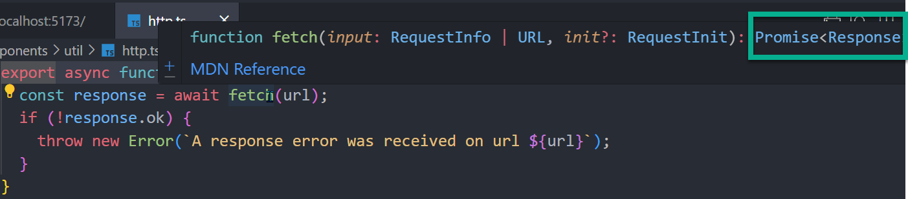
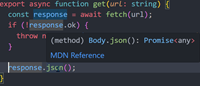

# Summary

This topic addresses how to properly type asynchronous React components, **from scratch**. However, the [TanStack Query library](https://tanstack.com/query/latest/docs/framework/react/overview) was recommended as a 3rd party library with strong support in data fetching.

There are also 3rd party libraries that allow you to define Typescript-first validation ([e.g. Zod](https://zod.dev/)) on the returned JSON (not just) output. Use npm to install this very small utility (`npm install zod`). _Strict_ mode must be specified in the **tsconfig.json** file.

REST API Mock data is available using the [jsonplaceholder APIs](https://jsonplaceholder.typicode.com/). Builtin APIs are available and custom REST request/responses can be created as well, if needed.

# Utility Get Function

```javascript
export async function get(url: string) {
  const response = await fetch(url);
  if (!response.ok) {
    throw new Error(`A response error was received on url ${url}`);
  }

  const data = (await response.json()) as unknown;
  return data;
}
```

**Notes:**

- The generic `fetch` function available in Javascript implements a `Promise` type and a `response` value, as shown in the screenshot below.

  

- A Promise is asynchronous and requires the use of the await keyword in front of the function.

- The method converting the response to `json` also is a type of `Promise` that must have an `await` prefix.

  

  # App Component

  Very simply, all of the logic to fetch the data was implmented in the parent component.

  ```javascript
  import { type ReactNode, useEffect, useState } from "react";
  import { BlogPost } from "./components/BlogPosts";
  import BlogPosts from "./components/BlogPosts";
  import { get } from "./components/util/http";
  import fetchingImg from "./assets/data-fetching.png";
    type RawDataBlogPost = {
    id: number;
    userId: number;
    title: string;
    body: string;
    };
    function App() {
    const [fetchedPosts, setFetchedPosts] = useState<BlogPost[]>();
    const [isFetching, setIsFetching] = useState(false);

    useEffect(() => {
        setIsFetching(true);

        async function fetchPosts() {
            const data = (await get(
            "https://jsonplaceholder.typicode.com/posts"
            )) as RawDataBlogPost[];

            const blogPosts: BlogPost[] = data.map((rawPost) => {
                return {
                id: rawPost.id,
                title: rawPost.title,
                text: rawPost.body,
                };
            });

            setIsFetching(false);
            setFetchedPosts(blogPosts);
            }
            fetchPosts();

    }, []);

    let content: ReactNode;

    if (isFetching) {
        content = <p id="loading-fallback">Fetching posts...</p>;
    }

    if (fetchedPosts) {
        content = <BlogPosts posts={fetchedPosts} />;
    }

    return (
        <main>
            
            {content}
        </main>);
    }
    export default App;
  ```

**Notes:**

- State was created for the retrieved posts and a boolean to indicate if the data is being fetched.
- The `useEffect` hook wraps the logic to perform the fetch.
- An inner function was created inside the hook to wrap the get utility function as asynchronous.
- The `map` function on the returned data implements a callback to return a new array that matches the input required by the `BlogPosts` component.
- The `content` prop type was used to wrap the `BlogPosts` component with the `posts` input parameter.
