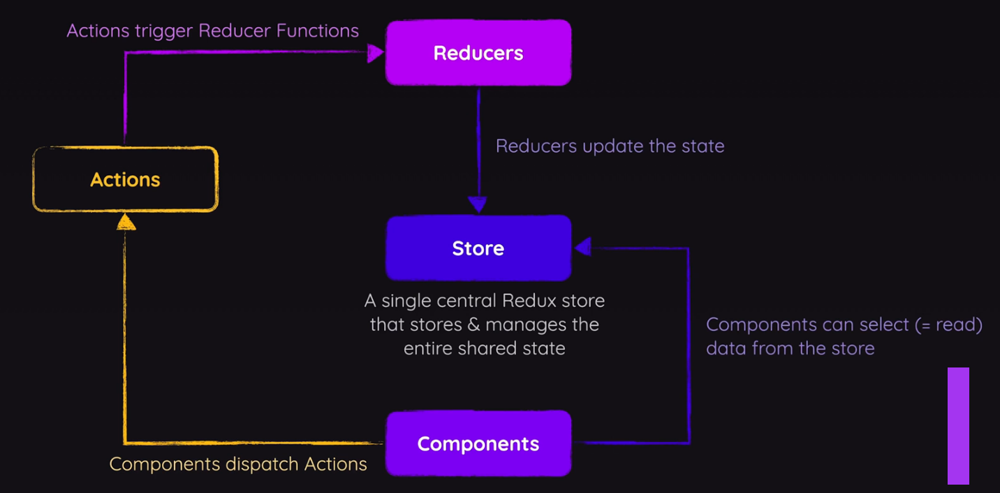

1. [Installation](#installation)
2. [How Redux Works](#how-redux-works)
3. [Creating the Redux Configurations](#creating-the-redux-configurations)
   1. [Create the Redux Slice](#create-the-redux-slice)
   2. [Create the Redux Store](#create-the-redux-store)
   3. [Create Custom Dispatch Hook](#create-custom-dispatch-hook)
4. [Using the Redux Cart Store](#using-the-redux-cart-store)
   1. [App Component](#app-component)
   2. [Header Component](#header-component)
   3. [Product Component](#product-component)

# Installation

- [Redux Setup](https://redux.js.org/introduction/getting-started) and how - In a terminal run: `npm install @reduxjs/toolkit`
- Redux is a standalone library. For it to run with the above toolkit, run: `npm install react-redux`
- Then start the server locally: `npm run dev`

# How Redux Works



# Creating the Redux Configurations

There are a good number of files to be created and code written to implement a Redux store (aka "slice"). The steps below are listed sequentially, as types and functions need to be exported and then referenced by other TS files.

The sample application is that of a shopping application with products and a shopping cart. Below is the component hierarchy.


## Create the Redux Slice

Create a src/store directory and in there begin creating TS files that will define the Redux configs for the application.

1. Create the `src/cart-slice.ts` file that defines the state associated with the shopping cart application.

   **Note**: The RTK `createSlice` function accepts an initial state, an object of reducer functions, and a "slice name", and automatically generates action creators and action types that correspond to the reducers and state.

```javascript
import { createSlice } from "@reduxjs/toolkit";

export type CartItem = {
  id: string,
  price: number,
  quantity: number,
};

type CartState = {
  items: CartItem[],
};

const initialState: CartState = {
  items: [],
};

export const cartSlice = createSlice({
  name: "cart",
  initialState,
  reducers: {},
});
```

**Note**: The `reducers` object above will be filled in a section below.

## Create the Redux Store

1. In the store directory, create a `store.ts` file that defines a Redux **slice** which is a portion of the state to be managed in the application.

In the example shown here, only one slice was needed to manage all of the state associated with a shopping cart. A larger application would likely have multiple slices.

```javascript
import { configureStore } from "@reduxjs/toolkit";
import { cartSlice } from "./cart-slice";

export const store = configureStore({
  reducer: {
    cart: cartSlice.reducer,
  },
});
```

2. Update the **store/store-slice.ts** file to define reducer actions (`addToCart`, `removeFromCart`), in this example to add and remove items from the shopping cart.

```javascript
export const cartSlice = createSlice({
  name: "cart",
  initialState,
  reducers: {
    addToCart(
      state,
      action: PayloadAction<{ id: string, title: string, price: number }>
    ) {
      const itemIndex = state.items.findIndex(
        (item) => item.id === action.payload.id
      );
      // if product id was found in above search
      if (itemIndex >= 0) {
        state.items[itemIndex].quantity++;
      }
      // if found then just increment the quantity which has to be added
      else {
        state.items.push({ ...action.payload, quantity: 1 });
      }
    },
    removeFromCart(state, action: PayloadAction<string>) {
      const itemIndex = state.items.findIndex(
        (item) => item.id === action.payload
      );
      // if product quantity is = 1, then remove it
      if (state.items[itemIndex].quantity === 1) {
        state.items.splice(itemIndex, 1);
      }
      // otherwise decrement the product quantity
      else {
        state.items[itemIndex].quantity--;
      }
    },
  },
});

// export actions that will be referenced in the useCartDispatch hook
export const { addToCart, removeFromCart } = cartSlice.actions;
```

**Notes:**

- In Redux Toolkit, the `PayloadAction<T>` type is used to define the type of an action that carries a payload. It's a generic type provided to ensure type safety when working with actions.

3. With the actions defined, now update the **src/store.ts** to add dispatcher types that will be referenced in the application (hence the exports).

```javascript
export type AppDispatch = typeof store.dispatch;
export type CartState = ReturnType<typeof store.getState>;
```

**Notes:**

- The `ReturnType` Typescript utility returns a type for type declared for a function, in the case above, for the `getState`.

## Create Custom Dispatch Hook

The useDispatch Redux hook is discouraged, favoring the definition of a custom hook.

- When definining a hook do so inside a new file, **src/store/hook.ts**. Follow the custom setup shown in this file as a standard setup for Redux.

- The `useCartDispatch` hook defined here provides access to the state and a way dispatch to one of the actions defined in the `cartSlice reducers` object.

```javascript
import {
  useDispatch,
  useSelector,
  type TypedUseSelectorHook,
} from "react-redux";

import { type AppDispatch, type CartState } from "./store.ts";

// Create type that references dispatcher function to be run in components
type DispatchFunction = () => AppDispatch;

// create custom hooks to be used where dispatch is to be done
export const useCartDispatch: DispatchFunction = useDispatch;

export const useCartSelector: TypedUseSelectorHook<CartState> = useSelector;
```

**Notes:**

- It's a good practice to create dedicated selector functions that encapsulate the logic for accessing specific parts of the state, to improve reusability and maintainability.

# Using the Redux Cart Store

Now that the shopping cart store has been written, it's time to reference the hooks, starting with the `App` component.

## App Component

```javascript
import Header from "./components/Header.tsx";
import Shop from "./components/Shop.tsx";
import Product from "./components/Product.tsx";
import { DUMMY_PRODUCTS } from "./dummy-products.ts";
import { Provider } from "react-redux";
import { store } from "./store/store.ts";

function App() {
  return (
    <Provider store={store}>
      <Header />
      <Shop>
        {DUMMY_PRODUCTS.map((product) => (
          <li key={product.id}>
            <Product {...product} />
          </li>
        ))}
      </Shop>
    </Provider>
  );
}
export default App;
```

**Notes:**

- The `store` parameter on the react-redux `Provider` component defines the scope or availability of the state in the component tree. This is analogous to the Provider component in the React Context API.

## Header Component

This component is focused on allowing the user to open a modal dialog to view the contents of items added to the cart.

```javascript
import { useState } from "react";

import Cart from "./Cart.tsx";
import { useCartSelector } from "../store/hook.ts";

export default function Header() {
  const [cartIsVisible, setCartIsVisible] = useState(false);
  const cartQuantity = useCartSelector((state) =>
    state.cart.items.reduce((val, item) => val + item.quantity, 0)
  );
  function handleOpenCartClick() {
    setCartIsVisible(true);
  }

  function handleCloseCartClick() {
    setCartIsVisible(false);
  }

  return (
    <>
      {cartIsVisible && <Cart onClose={handleCloseCartClick} />}
      <header id="main-header">
        <div id="main-title">
          
          <h1>Elegant Redux</h1>
        </div>
        <p>
          <button onClick={handleOpenCartClick}>Cart ({cartQuantity})</button>
        </p>
      </header>
    </>
  );
}
```

**Notes:**

- Separate state (`cartIsVisible`) is defined in the Header component to control whether the dialog is visible.

- The `cartisVisible` state really means the the cart can be visible if the user clicks on the Cart button to open it.

- The Header component defines the event handlers to open or close the Cart dialog box.

## Product Component

The user can add one or more products to the cart in this component. The `addToCart` dispatch function in the `useCartDispatch` custom hook provides this.

```javascript
import { addToCart } from "../store/cart-slice";
import { useCartDispatch } from "../store/hook";

type ProductProps = {
  id: string,
  image: string,
  title: string,
  price: number,
  description: string,
};

export default function Product({
  id,
  image,
  title,
  price,
  description,
}: ProductProps) {
  const dispatch = useCartDispatch(); // in lieu of useDispatch

  function handleAddToCart() {
    dispatch(addToCart({ id, title, price }));
  }

  return (
    <article className="product">
      
      <div className="product-content">
        <div>
          <h3>{title}</h3>
          <p className="product-price">${price}</p>
          <p>{description}</p>
        </div>
        <p className="product-actions">
          <button onClick={handleAddToCart}>Add to Cart</button>
        </p>
      </div>
    </article>
  );
}
```
