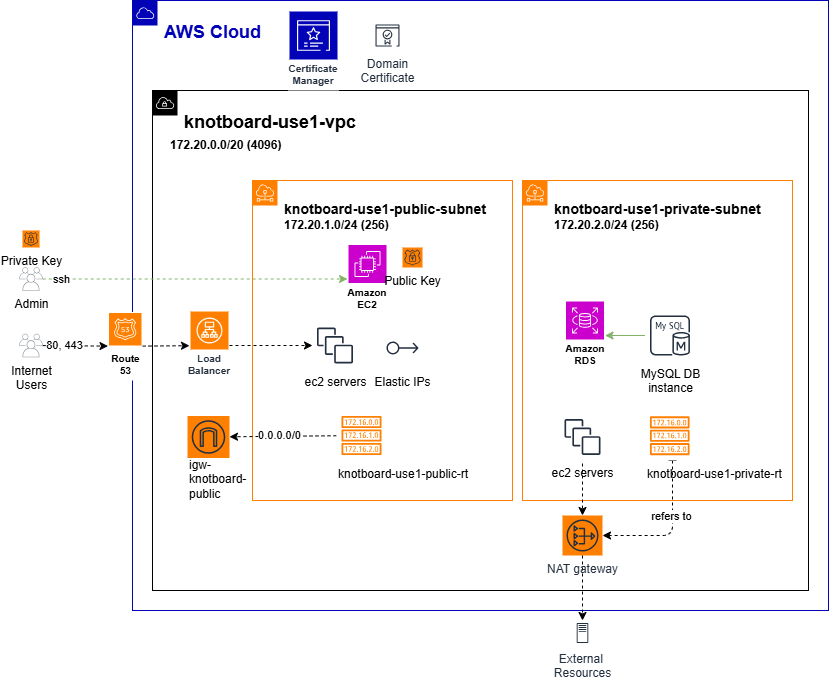
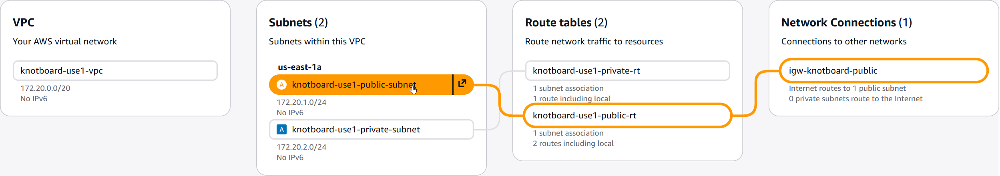
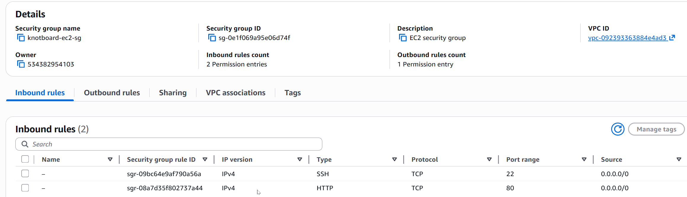
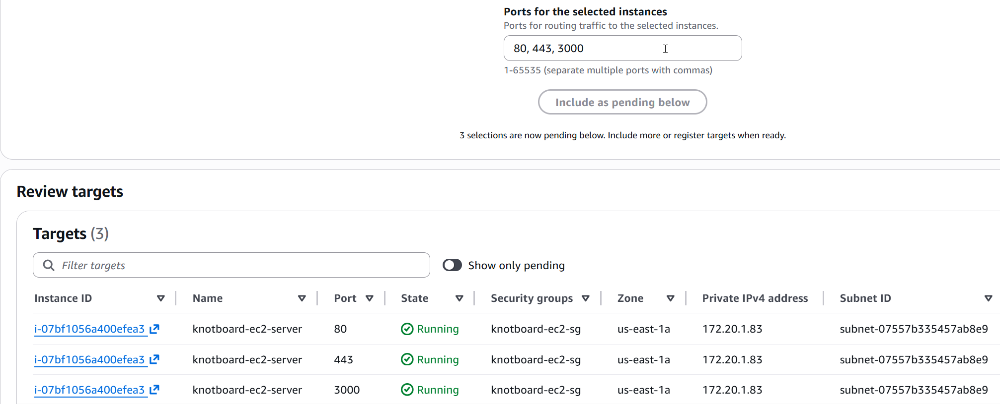
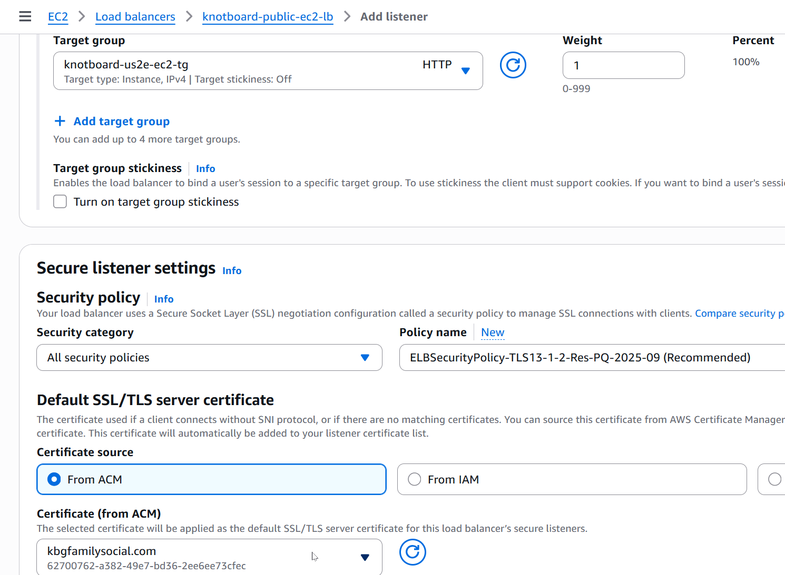
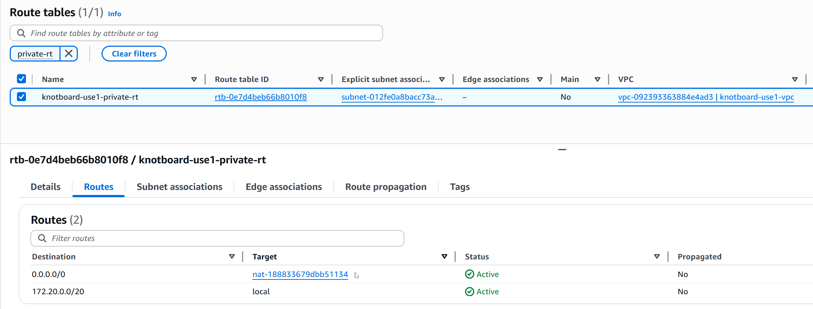
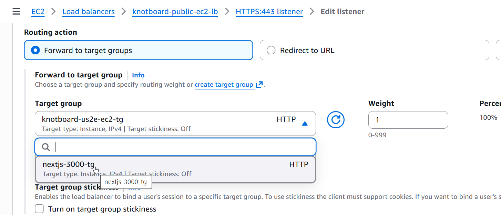
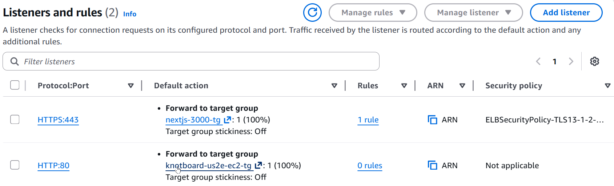

1. [Configure AWS](#configure-aws)
2. [Diagram](#diagram)
3. [Route 53](#route-53)
4. [AWS Certificate Manager (ACM)](#aws-certificate-manager-acm)
5. [VPC](#vpc)
   1. [Subnets](#subnets)
   2. [Internet Gateway](#internet-gateway)
6. [EC2](#ec2)
   1. [User Data](#user-data)
   2. [Test EC2 Instance Startup](#test-ec2-instance-startup)
   3. [Test SSH Access to EC2 Instance](#test-ssh-access-to-ec2-instance)
   4. [Security Groups](#security-groups)
   5. [Application Load Balancer](#application-load-balancer)
7. [NAT Gateway](#nat-gateway)
   1. [Testing the NAT Gateway Works](#testing-the-nat-gateway-works)
   2. [Removing the NAT Gateway](#removing-the-nat-gateway)
8. [Configure the Family Social App](#configure-the-family-social-app)
9. [Reconfigure the Load Balancer](#reconfigure-the-load-balancer)

---

# Configure AWS 
This topic documents the steps followed to configure AWS for the Knotboard Games runtime platform as depicted in the next section. The real purpose is to document the configuration setup in the event it has to be repeated.

# Diagram



# Route 53
Route 53 is the Domain Name Server for AWS. Although the steps to create a domain and a digital cert can be done differently than suggested here, follow these steps. 

1. Submit a Domain provisioning request in AWS Route 53. In the request the domain search will validate it is a unique domain. 
2. After submitting the request, a hosted domain will be created in Route 53 for the domain. It will initially contain two records: NS and SOA. 
3. What the domain still requires are two more records.

   - A `CNAME record` referencing the digital certificate which is created in the next section.
   - An `A record` referencing the application load balancer created starting with the VPC and subsequent steps below. 

# AWS Certificate Manager (ACM)
1. Submit a request for a certificate, specificying the domain created in Route 53.
2. After the certificate request has completed and is validated, select the `Create Records in Route 53` option in ACM.
3. Confirm the CNAME record was created in Route 53 referencing the digital certificate.

At this stage a lot of configuration remains to create a load balancer which is the last record to be added to the Route 53 domain.

# VPC 
It's where all things start when configuring a platform in AWS. Areas that pertain to the VPC (shown below) are distinct from things defined in other AWS services like EC2. The key configuration elements are listed below. 

- Subnets, Route Tables, Internet Gateways, Elastic IPs
- Security Gateways, NAT Gateways (private subnets)
- VPNs, DNS, Firewals,

## Subnets
Initially two subnets will be create, a `public` subnet that accomodates inbound traffic and another `private` subnet to host services to be used internally and not available publicly. Both need IP addresses (and CIDR ranges).

1. When creating the VPC provide a CIDR with sufficient IP addresses: using either /16 or /20 to create 64K or 4K ip addresses. 
2. Create the public and private subnets. 
   - Use a smaller CIDR unit (/24) for each subnet that will allocate 256 IP addresses for each of the subnets. 
   - This very nicely fills in an IP address range, e.g. `172.20.1.0 - 172.20.1.255`, as in the case of the **public subnet**. 
   - The **private subnet** IP range is then easily recognizable as well, `172.20.2.0 - 172.20.2.255`.
   
## Internet Gateway

The public subnet that will be accessed by anyone/anywhere will host services like EC2 that need to post outbound responses. This is the purpose of the Internet Gateway. 

1. Create the Gateway
2. Associate it with a VPC and the public subnet.

Below are the KBG AWS VPC details. The public subnet is highlighted to emphasize the connection to the Internet Gateway for outbound communications from the EC2 servers.



# EC2
It's the Compute platform for AWS, where servers are launched and part of app load balancers.

- Instance Types, AMIs, EBS
- Key Pairs
- Elastic IPs
- Load Balancers, Trust Groups

When launching a new EC2 server there are primary properties that should be included: 

- **Instance Type**: `Amazon` Linux, `t3.micro`
- **Network**: **confirm VPC and subnet** (public), auto-assign public IP is `enabled`
- **Key pair** for SSH access is selected (if created, use RSA and PEM format) 
- Create **Security Group**: meaningful sg name and description (e.g. `knotboard-ec2-sg`)
- **Inbound SG rules**: ssh (`TCP/22`) and anywhere (`0.0.0.0/0`)
- **Outbound SG rule**: anywhere (`0.0.0.0/0`)
- **Advanced Details** (expand): User data script for EC2 network test. (The User data script is executed once at boot time of the EC2 instance.)
- **Elastic IP**: Allocate an Elatic IP and then associate an EC2 instance to it ($)

## User Data
This is an optional script found in the Advanced section that allows something to be provision when the EC2 instance first starts. To assist in testing of the configuration, we'll provision an Apache server and a bit of HTML to display the IP address of the server when the EC2 instances runs. Two scripts are provided, for Amazon (the one we're using) and Ubuntu Linux instances. 

**Amazon User Data**
```bash
#!/bin/bash
sudo yum update
sudo yum install httpd -y
echo "<h1>Server Details</h1><p>Hostname: <strong>$(hostname)</strong></p><p>IP
Address:<strong> $(hostname -I | cut -d" " -f1)</strong></p>">/var/www/html/index.html
sudo systemctl start httpd
sudo systemctl enable httpd
```

**Ubuntu User Data**
```bash
#!/bin/bash
yes | sudo apt update
yes | sudo apt install apache2
echo "<h1>Server Details</h1><p><strong>Hostname :< /strong> $(hostname)</p><p><strong>IP
Address :< /strong> $(hostname -I | cut -d" " -f1)</p>">/var/www/html/index.html
sudo systemctl restart apache2
```

## Test EC2 Instance Startup
1. Get public IP address and put into browser tab
2. Verify the IP address displayed on the output matches the private IP and DNS name of the EC2 instance just launched

## Test SSH Access to EC2 Instance
1. Allocate/Associate Elastic IP to running EC2 instance
2. Using your local private key PEM create SSH session to the EC2 server using Elastic IP

## Security Groups
Security groups define the rules around inbound and outbound routes. Shown below are is the security group inbound rules for the public subnet.



## Application Load Balancer
Load balancers can be internet facing or internal. In our topography, the public subnet EC2 servers would have a `public facing LB` that expose our EC2 web services. The private subnet can host internal services like a API gateway or internal EC2 servers and these necessitate an `internal LB`.

**Target Group**
The **target group** is necessary for use by a load balancer in order to identify the EC2 instances targeted by the load balancer. When creating a target group, one may do so in a number of ways, as instances or IP addresses (Network LB), the former being the most typical. 

- Select the protocol and ports (individual ports can be registered) 
- Select the VPC associated with the load balancer.
- Select the target of the LB, i.e. EC2 instances.

As shown below, three different ports can be registered for each, although this would not be normal. At some point, only port 443 will be allowed in.



**ALB Configuration**

After creating the target group, then create an ALB and associate the above target group to it. The best way to do this is to select the option to create a LB in the target group which will say that a LB is not associated.

- VPC and the correct (public) subnet
- Security Groups 
  - Specify public SG which contains 22/80/443 ports
  - **VERY IMPORTANT**: Also select the default which is all traffic from anywhere
- Make sure there are two or more Availability Zones (AZ)
  - If not, then create another public subnet in a different AZ
- Protocol (HTTP) and Port (80)
- To configure the ACM certificate add another listener with `HTTPS protocol` and `port 443` and select the certificate that has been added to the domain in the Route 53 CNAME record.



# NAT Gateway
RDS and (possibly) EC2 instances will run in the private subnet. Communication from the private subnet externally is accomplished with a NAT Gateway. When you create a NAT Gateway, it is by default in the public subnet. For services in the private subnet to have public access, the private route table must be configured with a route to the NAT Gateway, as shown below.



## Testing the NAT Gateway Works
If an EC2 instance is launched in the private subnet it is done without the public IP enablement.
1. Log into the public EC2. 
2. Create a .pem file by pasting in the private key contents in the pem file used to connect to the public EC2.
3. Run `chmod 400` on the pem file to change to read-only.
4. Create a run .sh file like the one below that references the private IP address following `ec2-user@`. (Be sure to run `chmod +x` on the file.)
5. Connect via ssh to the private EC2 instance.
6. Run `curl ipinfo.io` command in the private EC2 instance, or simpley `ping google.com`, both of which will respond.

## Removing the NAT Gateway
After testing that the NAT Gateway provides the ability to access the internet, removing the NAT Gateway demonstrates it was the gateway that provides the internet access. In my case, it was deleted because it allocates and uses an Elastic IP which is an unnecessary AWS cost at present.

After deleting the NAT Gateway repeating the previous steps will not work, which confirms that the NAT Gateway was providing the internet access.

# Configure the Family Social App

See the [instructions in this separate markdown file](./README-app-config) for the configuration of Node.js, Git, and several projects to be run in the EC2 server.

# Reconfigure the Load Balancer
After confirming the Family Social app is running in the EC2 server(s) on port 3000, it will be necessary now for the target group used by the LB to reference that port, instead of port 80 which was used to test the LB configuration. 

There are two steps: 

1. Create a new target group (rule) for HTTP and port 80. 
2. Then swap out the target group in the load balancer listener rule, as shown below.



3. This swap will need to be done for both the 443 and 80 listener ports in the load balancer.



4. The application will need to be restarted after the load balancer changes. See the app start steps in the [app configuration markdown file](./README-app-config.md#start-nextjs-app).

**Note**: `502 Bad Gateway` or `504 Gateway Timeout` errors indicate the application is not running and the load balancer has nothing to balance.


